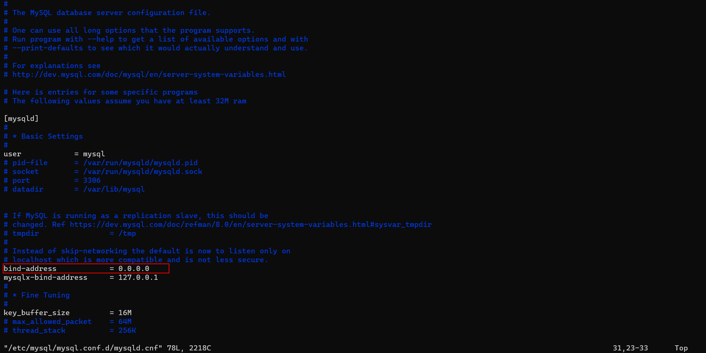
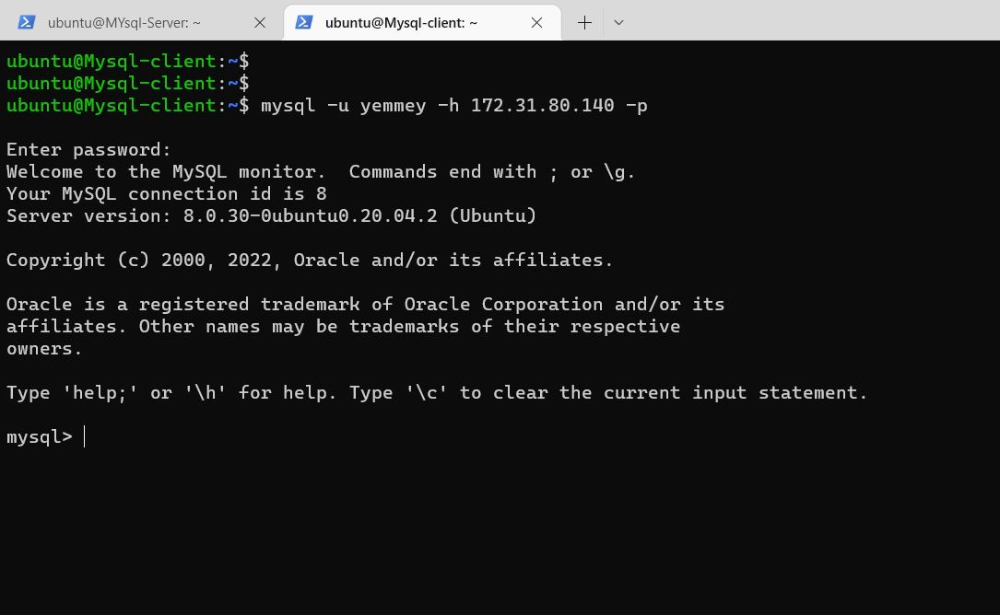
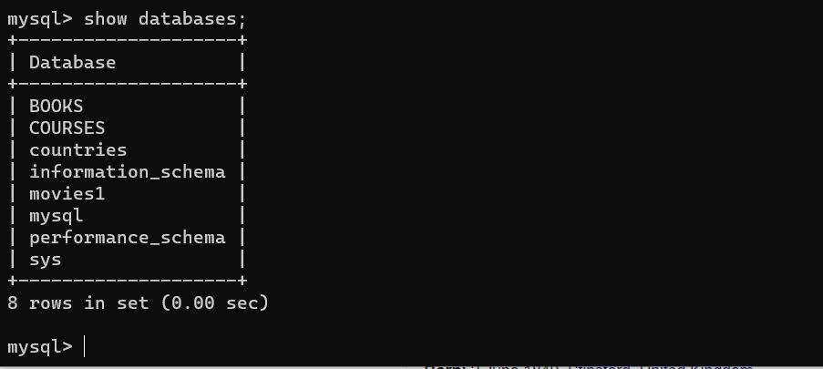
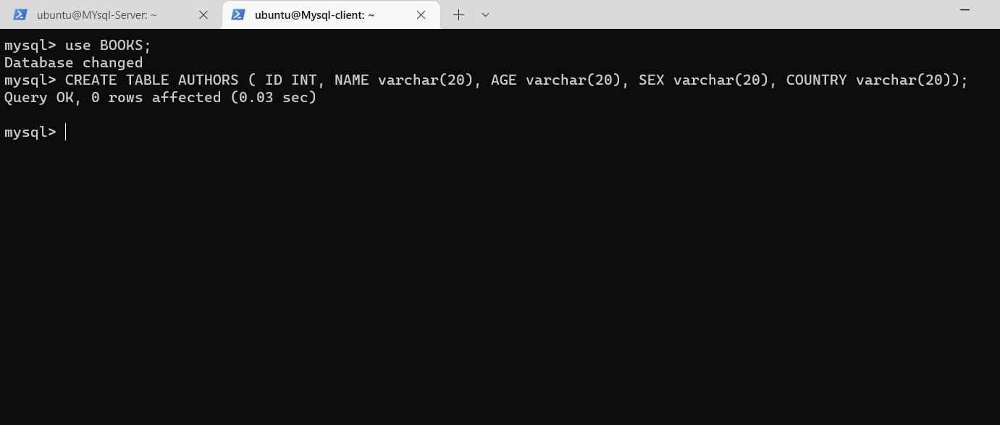
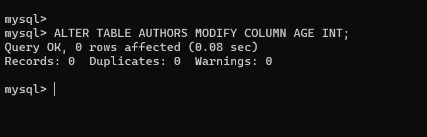
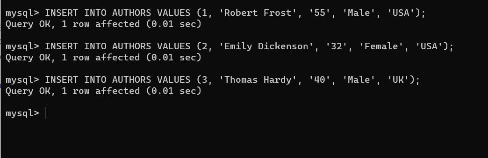
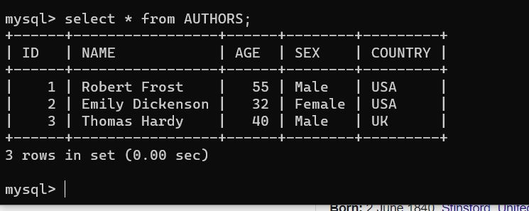
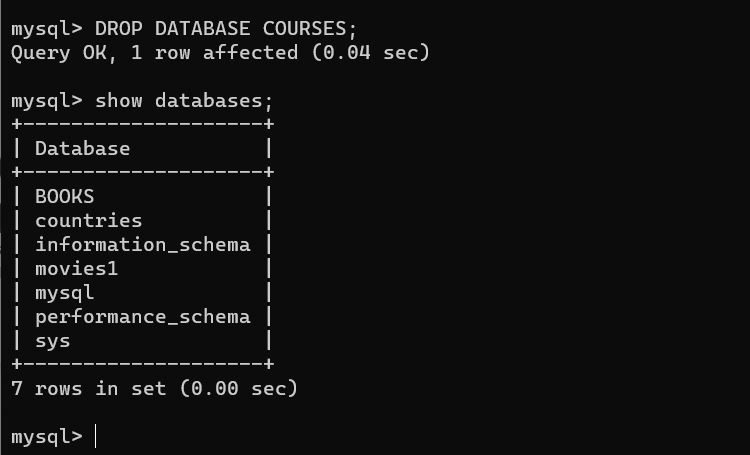
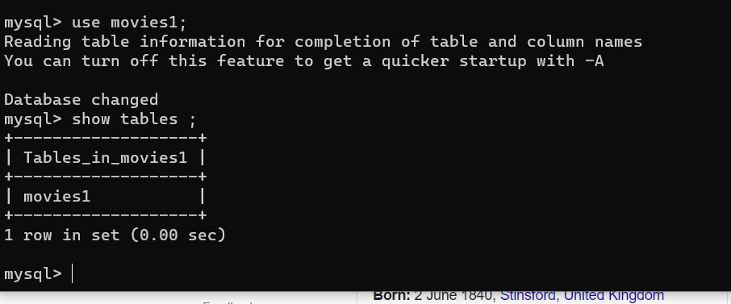
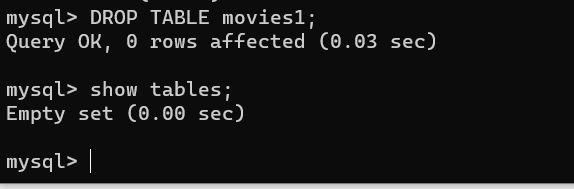

## ..........................IMPLEMENTING CLIENT-SERVER ARCHITECTURE USING RDBMS....................................
---

We will setup 2 EC2 servers on AWS and install MYSQL client and server packages on them respectively.

Create and configure two Linux-based virtual servers (EC2 instances in AWS).

`Server A name - mysql server`

`Server B name - mysql client`

Login to the server named Mysql Server and install the mysql-server package.

`sudo apt install mysql-server`

Login to the server named Mysql Client and install the mysql server and mysql-client package.

`sudo apt install mysql-server mysql-client`

To enable communication between the Sql Client and Sql Server we need to enable TCP port 3306, we will create a new entry in ‘Inbound rules’ in ‘mysql server’ Security Groups. 

`sudo vi /etc/mysql/mysql.conf.d/mysqld.cnf`

lets replace `127.0.0.1` to `0.0.0.0` in the bind-address as shown below.



lets create a user on mysql server , we would use this user to login from the client.

`CREATE USER 'test'@'%' IDENTIFIED WITH mysql_native_password BY 'Password@1'`

we will also grant the user full rights to all databases.

`GRANT ALL PRIVILEGES ON *.* TO 'test'@'';`

`FLUSH PRIVILEGES;`

let's go back to the Mysql Client shell and login to the Mysql Server to access the daatabase.

login using the `test` useraccount created.


`mysql -u test -h <ip address of database server> - p`



We have now been able to sucessfully login into the remote database server from the client as shown in the screenshot above.

Now lets create Database on our Database server, run the command below to create a database called `BOOKS`.

`CREATE DATABASE BOOKS;`


Now run the `show databases;` command to list the databases available on oue server.



As shown above we have sucessfully created the `BOOKS` database.

Lets create a table called `AUTHORS`inside the `Books` database by running the below command. but first run the `use BOOKS;` command to switch to the `BOOKS` database.

```
CREATE TABLE AUTHORS (
    ID INT,
    NAME varchar(20),
    AGE varchar(20),
    SEX varchar(20),
    COUNTRY varchar(20)
);
```


I noticed an error above when creating the table above the column `AGE` uses a `datatype` of `varchar` instead on `int`. we want the user to input the `AGE` in digits instead of typing in words as the case currently is since we are using `varchar`. Let us rectify this by modifying the table.

lets run the below command to change the ``AGE`` datatype to `INT` from `VARCHAR`.

`ALTER TABLE AUTHORS MODIFY COLUMN AGE INT;`



Now that we have succesfully modified the table with the correct datatype, let us insert records in to the table. 

We can insert records into tables by running the `INSERT` command as chown below.

`INSERT INTO AUTHORS VALUES (1, 'Robert Frost', 55, 'MALE', 'USA');`

We will insert 3 records as shown in the screenshot below.


let's run a `SELECT` command to query all records in the `AUTHORS` table. 

`SELECT * FROM AUTHORS;`



We can decide to delete a database by using the `DROP` command, 
lets delete the `COURSES` database on the database server.


Run the `DROP DATABASE COURSES;` command to delete the `COURSES` database as shown below.



We can see the `COURSES` database is no longer listed when we run the `show databases;`  command.

Finally just as we deleted a database, we can also delete a table by using the `DROP TABLE;` command. Let's delete the `movies1` table in the `movies1` database.



Run the `DROP TABLE movies1;` to delete the table from the database. Notice the `use movies1;` command which we used to switch to the `movies1` database. 

Now let's confirm the action we took was successful by running the `show tables;` command to shows tables in the `movies1` database.



In this project we have been able to install two servers `Mysql-Client` and `Mysql-Server`. We connected to the server using the client and carried out DDL and DML commands on the database server.

Thank you!!!


